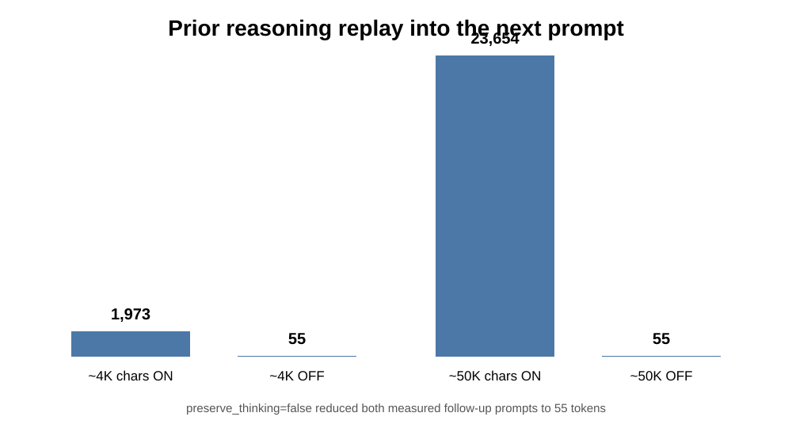
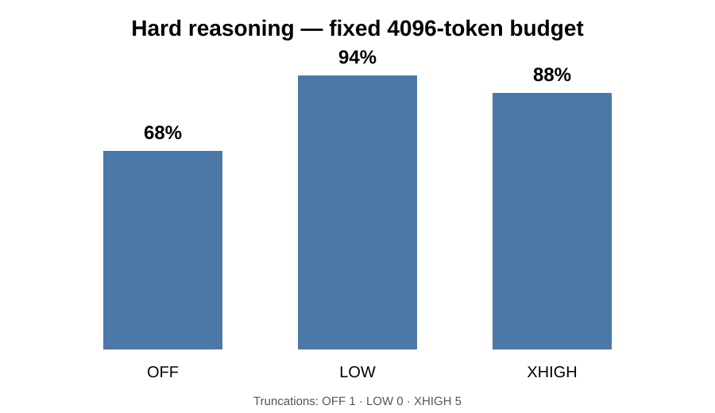
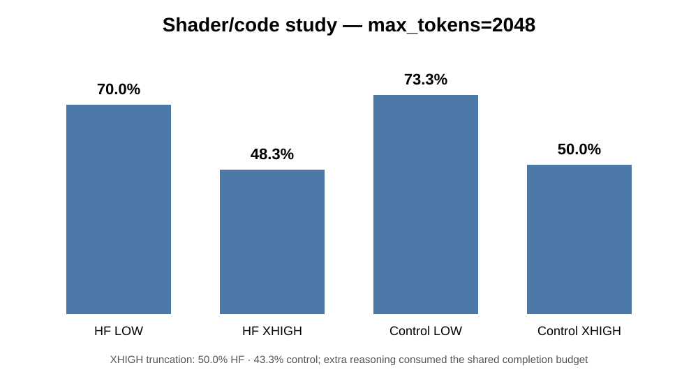
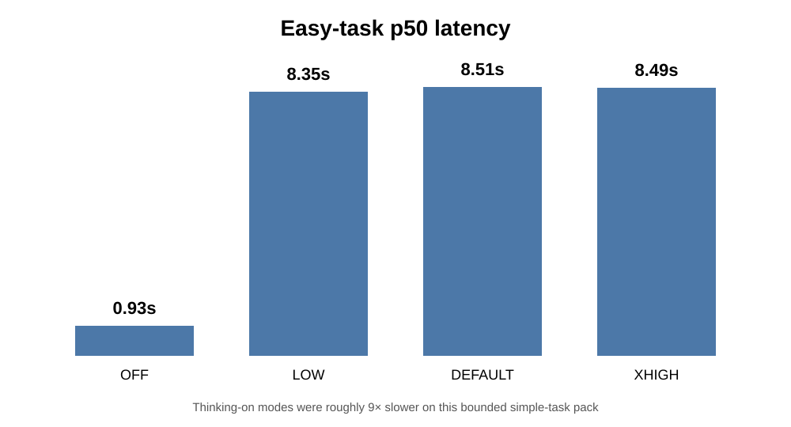
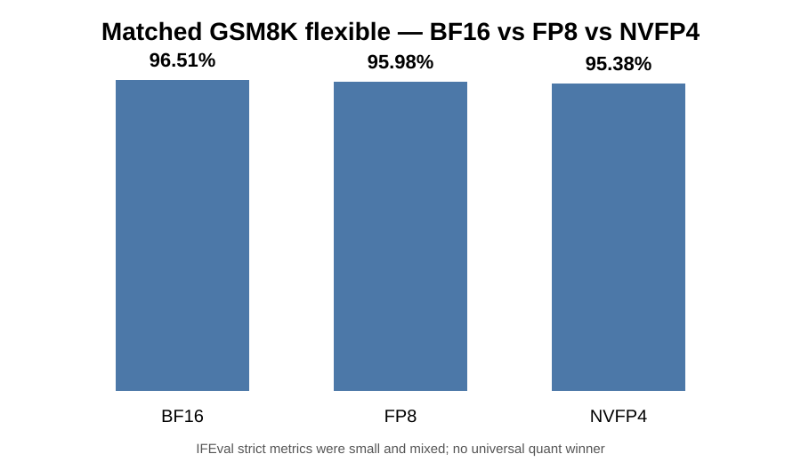
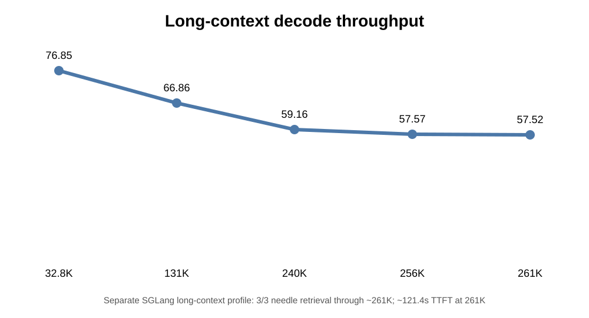
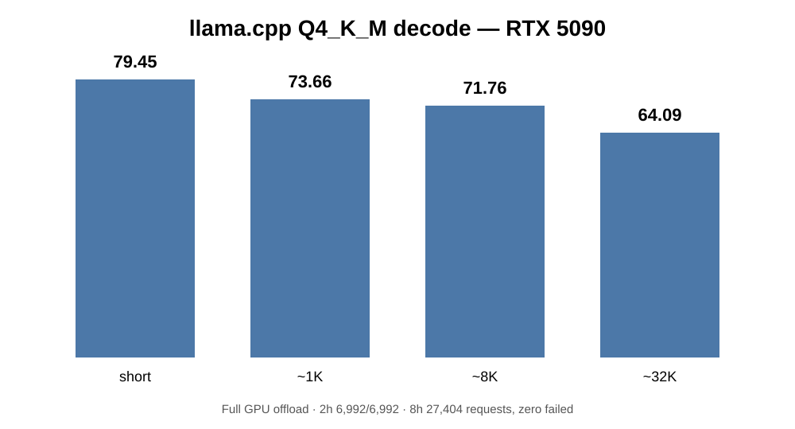
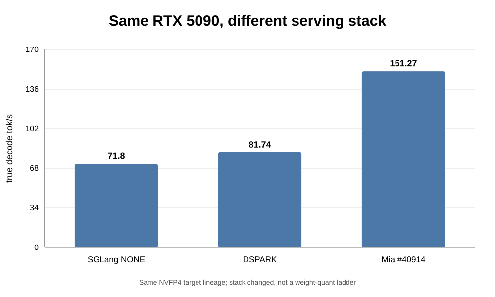

# Qwen 3.8 27B is not one number

## Several days, one RTX 5090, three DGX Sparks, and a lot of ways to make the same model look completely different

I did not want to test Qwen 3.8 27B once, screenshot a tokens-per-second number, and call it a benchmark.

I wanted to know what the model actually does when you change the things that matter in a real deployment:

**thinking mode, reasoning effort, output budget, temperature, quantization, runtime, KV allocation, speculative decoding, long context, tools, coding, and the benchmark harness itself.**

So I ran it across one RTX 5090 and three canonical DGX Spark deployments, kept the configs, failures, revisions, raw evidence, and the runs I threw away when they were not trustworthy.

The biggest result is not a single score.

> **Qwen 3.8 27B can look like a materially different model depending on how you deploy it.**

Not because the weights changed.

Because the system around the weights changed what I actually got.

This article only uses results I am willing to defend. If a run died, I say it died. If a protocol was wrong, it is a HOLD. If I did not reproduce a number, I do not publish the prettier number.

The full public evidence is here:

**https://github.com/Blackwellboy/qwen38-27b-is-not-one-number**

> **Post-draft supplemental result (19 Aug 2026):** after this article was written, a single preregistered ProgramBench task was rerun as a paired OFF/LOW/XHIGH/MEDIUM ablation. MEDIUM scored 308/502 tests (61.35%), LOW 253/502 (50.4%), OFF_REPEAT 241/502 (48.01%), while XHIGH failed the agent loop and scored 0/502. This is **non-leaderboard, one-task evidence**, not a universal ranking. See [Supplemental findings](SUPPLEMENTAL_FINDINGS.md).

---

# 1. Default thinking is more aggressive than it looks

The first rabbit hole was Qwen's thinking system.

On the pinned open Qwen 3.8 27B template I tested, leaving `reasoning_effort` unset resolves to the same rendered instruction as explicit `xhigh`.

In a 36-prompt live comparison:

**DEFAULT / unset vs XHIGH: 36 / 36 identical.**

So on this deployment, doing nothing is not a neutral reasoning setting.

It is effectively asking the model to think very hard.

There is another trap: `preserve_thinking`.

On the pinned template, the default preserves prior reasoning in the conversation history unless I explicitly turn it off.

I tested this directly.

A prior ~4,000-character thought produced a **1,973-token** next prompt with preservation on.

The same conversational turn with `preserve_thinking=false` was **55 tokens**.

With ~50,000 characters of prior reasoning:

**preserve on: 23,654 tokens**  
**preserve off: 55 tokens**

That is not a small tax.

In a long-running agent, old reasoning can quietly become a large part of every future request.

There is also a subtle difference between disabling thinking and merely giving it less room.

`enable_thinking=false` was clean in my thinking-off cells: zero reasoning leakage.

That matters because, as the next tests showed, **starving a thinking model with a small `max_tokens` value is not the same thing as turning thinking off.**

---

# 2. MEDIUM is the weirdest reasoning mode

This deserves its own section because saying either **"MEDIUM is real"** or **"MEDIUM is fake"** is too simplistic.

On the pinned open-27B template:

- `low` gets a dedicated LOW reasoning instruction.
- `xhigh` gets a dedicated XHIGH reasoning instruction.
- `medium` is accepted and thinking remains enabled.
- but `medium` does **not** inject a dedicated MEDIUM effort instruction.
- `high` is not accepted on this template and fails loudly.

So the best description I can give MEDIUM on this exact open deployment is:

> **thinking on, but without the dedicated LOW restraint or XHIGH nudge.**

It is a valid input to the template, but it is not a purpose-built middle instruction in the same sense as LOW and XHIGH.

That is why I do **not** currently use MEDIUM as my default "balanced" setting on this open model.

And I would not generalize this to every hosted Qwen service. Provider-side APIs can map the same effort labels differently. The lesson is narrower and more useful:

> **Do not assume a reasoning label means the same thing across an open chat template and a hosted inference service. Inspect the effective prompt or server semantics.**

---

# 3. LOW beat XHIGH on the hard pack — but that does not mean LOW is "smarter"

I built a 50-task hard-reasoning pack.

Same model. Same deployment. Same prompts. Same `max_tokens=4096`.

Only reasoning effort changed.

| Mode | Score | Truncations |
|---|---:|---:|
| OFF | 68% | 1 |
| LOW | **94%** | **0** |
| XHIGH | 88% | 5 |

The first obvious result is that **turning thinking off on genuinely hard work was a bad idea**.

OFF → LOW was a 26-point gain.

But the more interesting comparison is LOW versus XHIGH.

LOW scored higher overall, but XHIGH was also colliding with the output ceiling.

If I remove the five XHIGH truncations, XHIGH was correct on **44 of the 45 tasks that actually finished: 97.8%**.

LOW stayed at 94%, but it completed every task without truncating.

In the paired comparison:

**XHIGH-only wins: 0**  
**LOW-only wins: 3**

The McNemar result was not significant (`p=0.25`), so I am not going to call LOW inherently more intelligent.

I retried the five XHIGH misses with a larger 7,000-token completion ceiling.

Two recovered, after using **5,150** and **5,958 reasoning tokens**.

Two stayed wrong.

One was still truncating.

That changed my interpretation of the result.

**LOW was the better operating point under a realistic fixed budget.**

XHIGH needs headroom.

That is a deployment fact, not a personality trait.

---

# 4. The enemy is often the page, not the brain

The budget problem became even clearer in a separate shader/code study.

On this tested runtime path, reasoning and final output were competing inside the completion budget.

At `max_tokens=2048`, across 240 generations:

| Cell | Pass | Truncated | Mean reasoning tokens | Mean code tokens |
|---|---:|---:|---:|---:|
| HF recipe LOW | 70.0% | 21.7% | 646 | 90 |
| HF recipe XHIGH | 48.3% | 50.0% | 1,274 | 38 |
| Control LOW | 73.3% | 20.0% | 661 | 98 |
| Control XHIGH | 50.0% | 43.3% | 1,233 | 46 |

XHIGH often thought for roughly twice as many tokens and then had dramatically less room left to write the actual code.

That is why I am careful with the phrase **"max thinking is worse."**

Sometimes the model did not lose because its reasoning was worse.

It lost because **the page ended**.

I also ran a deliberately tiny 64-token starvation test.

LOW and XHIGH both truncated about **77.8%** of the time.

So if I want a concise answer, I do not leave thinking on and crush `max_tokens`.

I either:

**turn thinking off**, or  
**use LOW and give the final answer enough room to exist.**

There was a third failure mode too: requests that never got admitted.

In a 98-request exhaustion cell I saw:

**18 admission rejects**  
**10 length truncations**

and a starved exact-answer set where LOW at 16 or 32 tokens failed while OFF at the same budgets passed **8 / 8**.

Those are three different failures:

**the door never opened; the page ended; or thinking ate the page.**

A benchmark should not collapse all three into "the model got it wrong."

---

# 5. Easy work does not need a philosopher

The latency cost of unnecessary reasoning was enormous on simple tasks.

In a 466-request verbosity study, thinking-on modes used roughly **33× as many reasoning tokens as final-answer tokens** on the simple pack.

Median latency:

| Mode | p50 latency |
|---|---:|
| OFF | **0.93s** |
| LOW | 8.35s |
| DEFAULT / unset | 8.51s |
| XHIGH | 8.49s |

LOW did not make easy work cheap.

It shortened the reasoning, but the model was still in thinking mode.

OFF was the genuinely fast path.

A smaller 16-item controlled ON/OFF pack told the same story:

**OFF: 12 / 16, 0 reasoning tokens, median ~0.18s**  
**ON: 15 / 16, 1,674 reasoning tokens, median ~1.16s**

So this is how I currently route this open Qwen 3.8 27B deployment:

- **exact output / formatting / tiny JSON / simple lookup → thinking OFF**
- **everyday code / summaries / moderate analysis → LOW**
- **hard multi-step reasoning → LOW first**
- **XHIGH → deliberate escalation, with enough `max_tokens` to let it finish**

MEDIUM is intentionally absent from that recommendation for the template reason above.

And there is one more caveat for agents:

A cheaper reasoning mode can sometimes create more retries.

So the real cost metric is not always tokens per turn.

It is **tokens and wall time for the whole job**.

---

# 6. Temperature changed variance more than intelligence

I also ran a thinking-off temperature study.

36 items at each setting:

**0.0 → 36 / 36**  
**0.2 → 36 / 36**  
**0.4 → 36 / 36**  
**0.6 → 36 / 36**  
**0.8 → 35 / 36**

The bigger change was answer variance.

Unique answers per prompt rose from roughly **1.00 to 1.33** as temperature increased.

The official instruct-style sampling setting I tested also remained 36 / 36.

So my takeaway is not:

> "temperature 0 makes Qwen smarter."

It is:

> **for exact work and coding on this stack, temperature 0 made the model more deterministic without costing accuracy on this bounded pack.**

That is enough reason for me to start there.

---

# 7. NVFP4 did not fall over

Next I wanted to know how much quality we actually lost by compressing the model.

I deployed three canonical Qwen 3.8 27B arms on three DGX Sparks:

**BF16**  
**FP8**  
**NVFP4**

Same THINKING_OFF protocol.

Same pinned lm-eval 0.4.12 harness.

Each final arm completed:

**1,860 / 1,860 requests**  
**0 request errors**

The final quality board:

| Metric | BF16 | FP8 | NVFP4 |
|---|---:|---:|---:|
| GSM8K flexible | **96.51%** | 95.98% | 95.38% |
| GSM8K strict | **96.06%** | 95.83% | 95.22% |
| IFEval prompt strict | 81.52% | 81.33% | **81.89%** |
| IFEval instruction strict | 86.81% | 87.17% | **87.41%** |

That is a tiny spread considering how different the storage and compute formats are.

But I am **not** going to overclaim this.

BF16 still had the highest GSM8K score.

NVFP4 had the highest two strict IFEval measures.

The differences are small and mixed.

So the result is:

> **on this matched THINKING_OFF GSM8K + IFEval suite, aggressive quantization did not cause a quality collapse.**

Not:

> "NVFP4 is universally as smart as BF16."

That would require a much broader suite.

---

# 8. I threw away almost a day because the harness failed

This was the most annoying part of the campaign and probably the most important one to publish.

The first standardized quality attempt ran for roughly **19.5 hours**.

Then Main WSL OOM-killed the control plane.

Progress at interruption:

**BF16: 392 / 1,860**  
**FP8: 976 / 1,860**  
**NVFP4: 1,329 / 1,860**

All three remote model servers were still healthy.

But the response/cache evidence needed to resume and score the run had not survived in a defensible form.

I could have stitched the missing rows and produced a table.

I did not.

I marked the entire run:

**INTERRUPTED_NON_SCOREABLE**

Then I hardened the controller:

**systemd user service**  
**Restart=no**  
**append-only fsynced journal**  
**official lm-eval response resume**  
**exact run identity**  
**fail-closed locks**  
**score only after the exact terminal gate**

Then the second run failed for a completely different reason.

The lm-eval SQLite cache became read-only.

Roughly six more hours gone.

Again:

**discarded.**

The third clean recovery run finally sealed all three arms at 1,860 / 1,860.

That means the pretty quantization chart above is not the first set of numbers I saw.

It is the first set I was willing to publish.

That changed how I think about benchmarking more than any one Qwen score.

> **The model is only one component in a benchmark. The harness, cache, controller, template and scorer can manufacture a clean-looking number that means nothing.**

I would rather lose two days than publish a stitched run I cannot defend.

---

# 9. A 262K flag is not the context you actually got

Context length exposed another deployment trap.

On the official SGLang NONE profile on the RTX 5090:

`context_len = 262144`

But the realized KV allocation reported:

`max_total_num_tokens = 42624`

So on that launch:

**configured: 262,144**  
**realized capacity: 42,624**

I marked native 261K on that profile:

**HOLD_REALIZED_KV_CAPACITY**

rather than saying "262K works" because the config file contained the number.

A bounded three-needle retrieval still passed at about **12,712 prompt tokens**.

But that is not the end of the story.

A different SGLang long-context profile — NVFP4 target, FP8 KV, no speculative decoder — walked a tokenizer-sized needle ladder successfully:

**32,780 input → 76.85 gen tok/s**  
**131,084 → 66.86**  
**240,012 → 59.16**  
**256,012 → 57.57**  
**261,212 → 57.52**

At ~261K, TTFT was about **121.4 seconds**.

Three needles were still recovered.

So both statements are true:

> **Qwen 3.8 27B can function near its native ~262K context on the right deployment.**

and

> **a server configured for 262K can still have only ~42K of realized KV capacity.**

Same model.

Different stack.

Also: my llama.cpp Q4_K_M results are **not** 261K.

That path is sealed at functional 64K and 128K tests in this campaign.

I am keeping those claims separate.

---

# 10. The RTX 5090 number changed every time the stack changed

This is the easiest part of AI benchmarking to turn into a misleading screenshot.

On llama.cpp with the Unsloth Q4_K_M build, one RTX 5090 produced decode medians around:

**short: 79.45 tok/s**  
**~1K: 73.66 tok/s**  
**~8K: 71.76 tok/s**  
**~32K: 64.09 tok/s**

VRAM stayed around 19 GB through the 32K test.

That everyday card also survived:

**2-hour mixed soak: 6,992 / 6,992**

and:

**8-hour soak: 27,404 requests, zero failed**

Then I moved to official SGLang NVFP4.

With no speculative decoder, the matched-ish C1 cell was roughly:

**ISL 1,049**  
**OSL 1,024**  
**~71.8 true decode tok/s**

Exact output, decimal 9.9, JSON, tools and coding canaries passed.

Then DSPARK:

**ISL 1,038**  
**OSL 1,024**  
**81.74 true decode tok/s**  
**TTFT 0.124s**

And importantly:

I asked the old decimal trap again.

It returned **9.9**, not the historical broken 9.11 result.

Then came the biggest speed result of the campaign.

---

# 11. 151 tok/s was only useful after correctness passed

I wanted to reproduce a fast Qwen 3.8 configuration using:

**TurboQuant 4-bit KV + MTP3**

The first Mia attempt hit a CUDA toolkit mismatch.

That was a launch HOLD.

After moving the build to CUDA 13.2, the stock stack launched.

TQ4 KV was active.

MTP3 was active.

Realized KV capacity was large.

And the outputs were garbled.

Exact output failed.

JSON failed.

Tools failed.

Coding failed.

Multi-turn failed.

The decimal 9.9 canary happened to pass.

I stopped there and marked it:

**HOLD_CORRECTNESS**

This is exactly why I run correctness before chasing throughput.

A broken server can still print a beautiful speed number.

Then I applied patch `#40914` and repeated the frozen canaries.

They passed.

The matched C1 result:

**realized ISL: 1,056**  
**realized OSL: 1,024**  
**true decode: 151.27 tok/s**  
**TTFT: 0.920s**  
**E2E: 7.69s**  
**MTP accepted: 830 / 834 = 99.52%**  
**GPU memory: 28,918 MiB**  
**power: ~351.5 W**  
**temperature: 50°C**

I had seen a ~160 tok/s claim I wanted to reproduce.

I did not reproduce 160 under my matched test.

I got **151.27**.

That is the number I am publishing.

The sequence is more important than the headline speed:

**SGLang NONE ~71.8 → DSPARK 81.74 → patched TQ4 KV + MTP3 151.27 tok/s**

Same RTX 5090.

Very different serving systems.

Do not average them.

---

# 12. DFlash-2 is a runtime HOLD, not a model verdict

I also tested the explicit Qwen 3.8 27B DFlash-2 path.

The Qwen 3.8 target was valid, but the stock SGLang image did not contain/register the required `DFlash2DraftModel` support.

So the live result is:

**HOLD_PROTOCOL_RUNTIME_DFLASH2DRAFTMODEL_UNREGISTERED**

That does **not** mean:

"DFlash-2 does not work."

It means:

"this stock runtime could not load the required draft-model class."

I have since pinned a runtime containing the missing registration.

The live retry is follow-up work.

I am keeping the original HOLD immutable because that result is useful too.

---

# 13. What I will not claim from this data

There are a lot of tempting one-line conclusions I could write.

I am deliberately not writing them.

- **"LOW is smarter than XHIGH."** The budget/truncation mechanism matters.
- **"MEDIUM is not real."** It is accepted on the pinned open template; it simply lacks a dedicated MEDIUM instruction.
- **"Maximum thinking makes the model dumber."** XHIGH often ran out of room.
- **"NVFP4 is smarter than BF16."** The deltas are small and metric-dependent.
- **"NVFP4 equals BF16."** I did not establish universal equivalence.
- **"Qwen does 262K on every 5090 deployment."** One official profile realized only 42,624 KV tokens.
- **"llama.cpp did 261K."** Not in this campaign.
- **"DSPARK does 206 tok/s."** Not in my matched result. I measured 81.74.
- **"Mia does 160 tok/s."** I measured 151.27 after correctness passed.
- **"Native tools just work everywhere."** Official SGLang canaries passed; the three Spark OOB vLLM arms returned HTTP 400 for the native tools schema.
- **"A partial benchmark is close enough."** Two long quality runs were discarded before I accepted the third.

There are also old/superseded throughput numbers in the campaign history that I am not reusing as current claims.

The point of keeping the repo is that a failed or superseded result stays visible without quietly becoming the headline later.

---

# Where the campaign stands

The core findings in this article are sealed:

**thinking/template behaviour**  
**MEDIUM/LOW/XHIGH semantics on the pinned open template**  
**hard-reasoning effort comparison**  
**budget starvation**  
**verbosity/latency**  
**temperature study**  
**BF16 vs FP8 vs NVFP4 GSM8K + IFEval**  
**long-context functional evidence**  
**official SGLang NONE + realized-KV HOLD**  
**DSPARK**  
**Mia stock correctness HOLD**  
**Mia patched #40914 PASS at 151.27 tok/s**  
**llama.cpp Q4_K_M everyday/soak results**

The coding comparison is still finishing on the three Sparks.

Current durable state at the time of writing:

- The NVFP4 Spark arm HumanEval+ is sealed at **124 / 164 base (75.61%)** and **121 / 164 plus (73.78%)**
- The NVFP4 arm has moved into MBPP+
- The BF16 Spark arm HumanEval+ is still running
- The FP8 Spark arm HumanEval+ is still running

I am **not** turning that single NVFP4 HumanEval+ score into a three-way coding conclusion.

I will append the matched HumanEval+/MBPP+ board when the other arms seal.

I am treating **full BigCodeBench as follow-up rather than delaying this article**. The official/reference harness is already pinned and ready, but the article already has enough independent quality, coding, reasoning, context and serving evidence to stand without waiting for another long suite.

The last core hardware comparison I still want is the standardized Spark serving matrix:

**C1 / C4 / C8 + long-prompt C1**

with actual ISL/OSL, TTFT, E2E, throughput, memory, power, temperature, errors and restarts.

That will answer the deployment question the quality table cannot:

> **What do BF16, FP8 and NVFP4 actually cost and deliver on a DGX Spark?**

Everything else can be a follow-up:

**DFlash-2 corrected-runtime retry**  
**BigCodeBench**  
**AEON matched base-BF16 leg**  
**Mia 261K retrieval on the 151 tok/s stack**  
**GPQA once gated access is available**  
**MMLU-Pro after a valid harness path**  
**BFCL when native tools are genuinely supported on the Spark runtime**  
**Marlin after the PTX/toolchain gap is resolved**  
**YaRN 512K / 1M-class work**

Those are worthwhile experiments.

They do not need to hold this article hostage.

---

# The conclusion

After several days with Qwen 3.8 27B, the thing I trust least is a benchmark result with no deployment context.

A model result is not just:

**model + GPU = number**

It is closer to:

**model + revision + quant + runtime + template + reasoning policy + output budget + KV policy + speculative decoder + harness + workload = number**

Change one of those and the result can move a little.

Change several and you may think you are testing a different model.

I saw the same open 27B:

think almost nine times longer on easy work,

lose hard tasks because XHIGH exhausted the completion budget,

carry tens of thousands of tokens of old reasoning into a new turn,

hold quality surprisingly well from BF16 through NVFP4,

function around 261K on one profile while another "262K" profile only had 42K of realized KV,

and move from roughly **72 tok/s to 151 tok/s** on the same RTX 5090 depending on the serving stack.

I also watched two long benchmark attempts fail for reasons that had nothing to do with the model.

That may be the most important result of all.

> **The weights are only one component of the system.**

If your Qwen 3.8 result disagrees with mine, I genuinely want to see it.

But send the configuration with the number:

runtime, revision, template, reasoning effort, `max_tokens`, quant, KV settings, speculative settings, and the prompt/benchmark pack if you can.

I will rerun what I can.

I want the number that survives someone else sitting in the same seat.

**Repo / raw evidence:**  
https://github.com/Blackwellboy/qwen38-27b-is-not-one-number